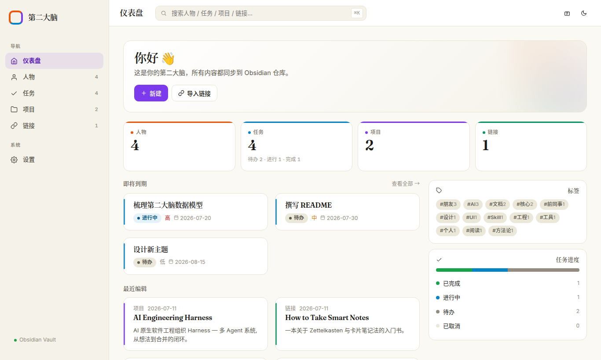
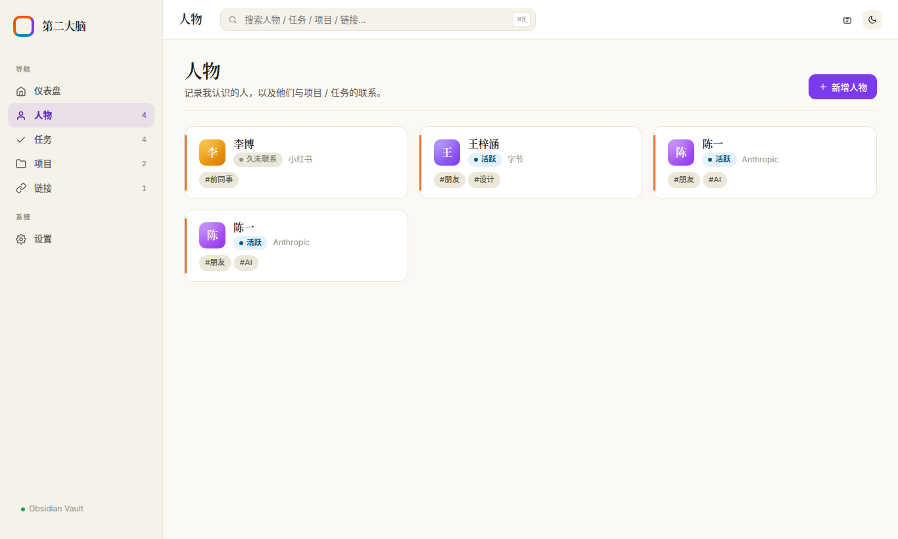
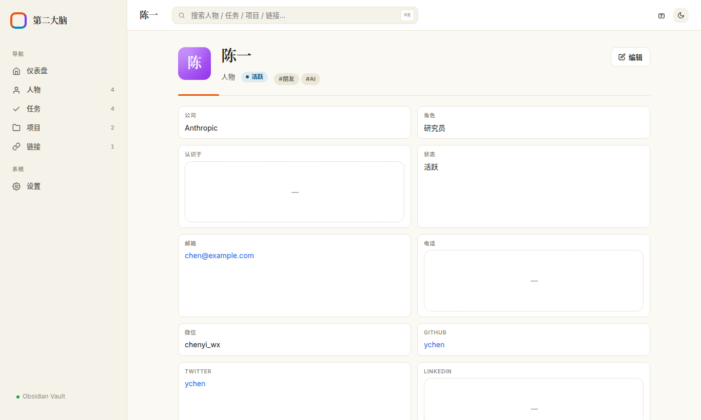
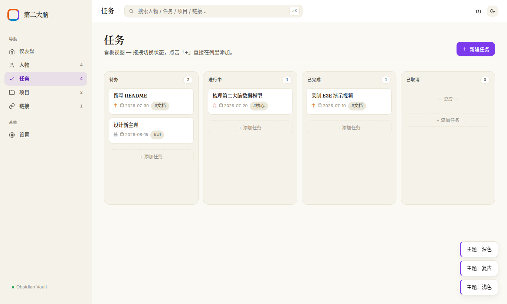
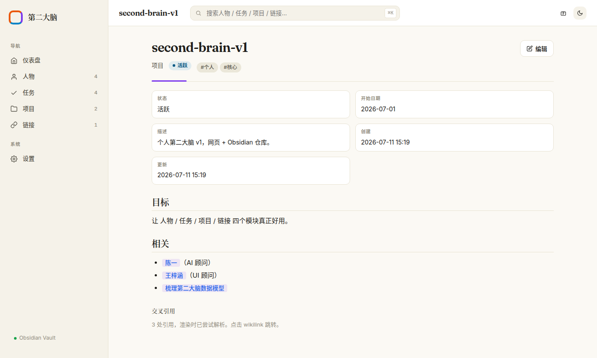
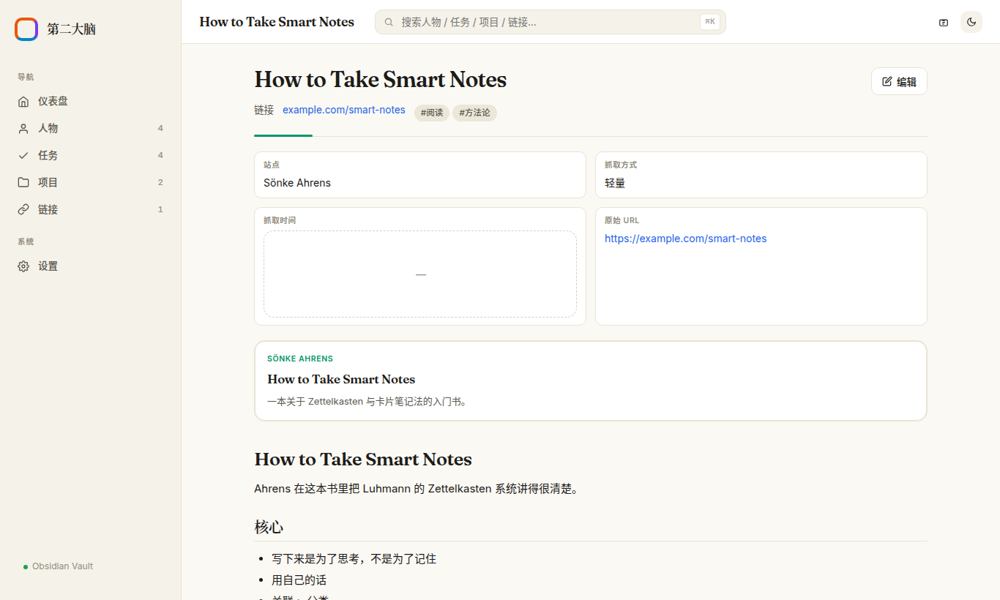
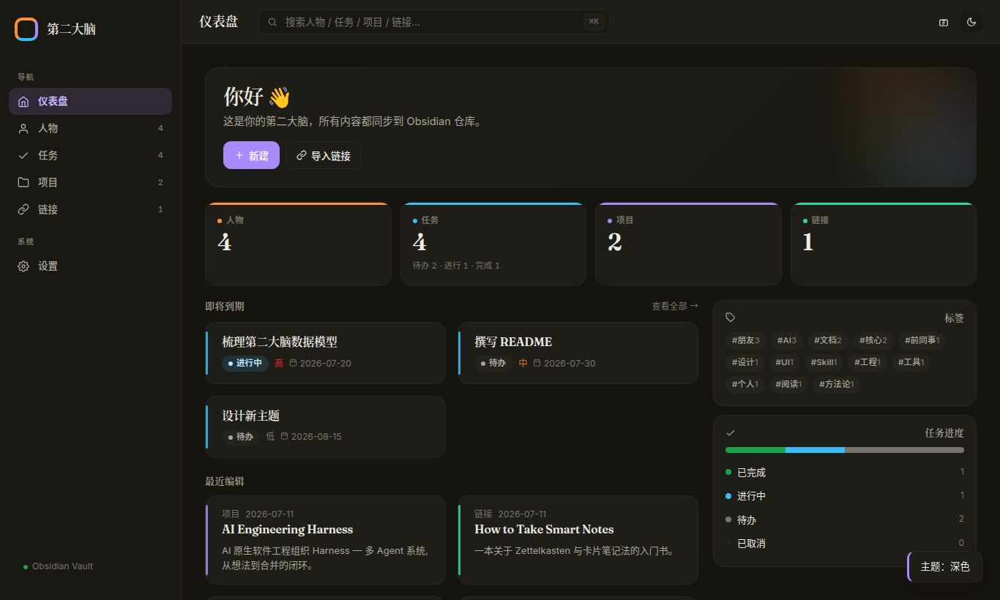
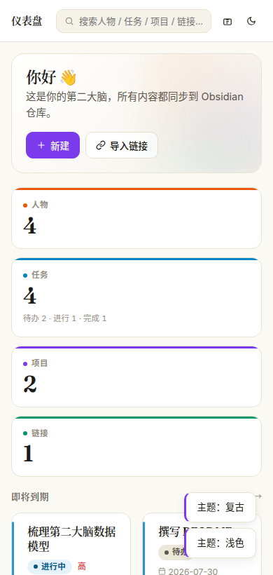

# 第二大脑 · Second Brain

> 一个本地运行的网页看板 + 知识库，所有数据以 Markdown 文件形式直接存放在你的
> [Obsidian](https://obsidian.md/) 仓库里 —— Obsidian 是 source of truth，
> 网页只是更好的输入和呈现层。

<p align="center">
  
</p>

## ✨ 它能做什么

| 模块 | 干什么 |
| :--- | :--- |
| **人物** | 记录认识的人、联系方式、社交账号、状态、标签 |
| **任务** | 看板视图（待办 / 进行中 / 已完成 / 已取消），优先级、截止日期、所属项目 |
| **项目** | 把人物 / 任务 / 链接聚合到一个项目里 |
| **链接** | 粘贴 URL 抓取标题 / 封面 / 描述，或深度抓取全文转 Markdown 入库 |
| **搜索** | 跨人物 / 任务 / 项目 / 链接的全文搜索 |
| **双向同步** | 网页和 Obsidian 编辑同一份 Markdown 文件 |

## 🎬 演示视频

<div align="center">
  <video src="docs/assets/demo.webm" controls width="900"></video>
</div>

> 也可在 [Releases 页面](https://github.com/lora-sys/second-brain/releases/tag/v0.1.0) 下载原始 `.webm`。

## 📸 截图

<details>
<summary><b>仪表盘</b> — 统计卡片、即将到期、最近编辑、标签云</summary>
<br>

</details>

<details>
<summary><b>人物列表</b> — 头像、状态、标签</summary>
<br>

</details>

<details>
<summary><b>人物详情</b> — 字段卡 + Markdown 正文</summary>
<br>

</details>

<details>
<summary><b>任务看板</b> — 四列状态自动归类</summary>
<br>

</details>

<details>
<summary><b>项目 + Wikilink</b> — <code>[[人物/张三]]</code> 双向引用，点击跳转</summary>
<br>

</details>

<details>
<summary><b>链接详情</b> — link card 预览 + 抓取的正文</summary>
<br>

</details>

<details>
<summary><b>暗色模式</b> — 右上角一键切换</summary>
<br>

</details>

<details>
<summary><b>移动端</b> — 390px 视口自适应</summary>
<br>

</details>

## 🚀 快速开始

需要 Node.js 20+。

```bash
git clone https://github.com/lora-sys/second-brain.git
cd second-brain
npm install
npm start
```

打开浏览器访问 **http://127.0.0.1:3939**。

首次启动会在仓库根目录生成 `config.json`，里面默认指向
`/home/lora/文档/Obsidian Vault`。你可以直接在网页的「设置」页面修改
Vault 路径、端口、目录命名。

### 数据结构

每个实体 = 一个 Markdown 文件，路径在 Vault 下：

```
Obsidian Vault/
├── 10-People/    ← 人物
├── 20-Tasks/     ← 任务
├── 30-Projects/  ← 项目
└── 40-Links/     ← 链接
```

你可以直接在 Obsidian 里编辑任何文件 → 刷新网页就同步。

人物示例：

```markdown
---
type: person
name: 张三
status: active
company: Acme
role: CTO
contact:
  email: zhang@example.com
social:
  github: zhangsan
tags:
  - 朋友
  - 技术
created: 2026-07-11T02:56:23.303Z
updated: 2026-07-11T02:56:23.303Z
---

张三是我大学同学，现在是 CTO。
相关：[[30-Projects/my-second-brain]]
```

更多 schema 示例见 [docs/data-model.md](docs/data-model.md)。

## 🧠 设计原则

- **本地优先**：所有数据在你硬盘上的 Obsidian Vault 里，没有任何云同步
- **Obsidian 是 source of truth**：网页只是输入层，文件可读可改
- **Git 友好**：Markdown + YAML，纯文本，可以放进任何版本控制
- **零依赖构建**：原生 HTML/CSS/JS + Node HTTP，没有 webpack / vite 那一套
- **可移植**：Vault 用 Syncthing / iCloud / Dropbox 同步，多台机器无缝衔接

## 🛠 技术栈

| 层 | 技术 |
| :--- | :--- |
| 后端 | Node.js (vanilla HTTP) · js-yaml · jsdom |
| 前端 | 原生 HTML / CSS / JavaScript · marked |
| 数据 | Markdown + YAML frontmatter |
| 端口 | `127.0.0.1:3939`（仅本地） |

整个项目没有框架（React / Vue 都没用），单文件服务 + 单文件前端，
理解起来 5 分钟，改起来 5 分钟。

## 📂 项目结构

```
second-brain/
├── server.mjs              # 入口
├── config.json             # 配置（vault 路径 / 端口 / 目录命名）
├── package.json
├── lib/
│   ├── server.mjs          # HTTP 路由 + 静态文件服务
│   ├── vault.mjs           # Markdown 文件 I/O + frontmatter
│   ├── frontmatter.mjs     # YAML 解析 / 序列化（带容错）
│   └── linkfetch.mjs       # 轻量 / 深度抓取，HTML → Markdown
├── public/
│   ├── index.html
│   ├── style.css
│   ├── app.js              # 单页应用（hash 路由）
│   └── lib/marked.min.js
├── docs/
│   ├── assets/demo.webm
│   ├── screenshots/
│   ├── architecture.md
│   └── data-model.md
├── recordings/             # 录制脚本（git-ignore 了产物）
│   └── e2e-demo.mjs
├── CHANGELOG.md
├── CONTRIBUTING.md
└── LICENSE
```

## 🧭 路线图

按优先级递减：

- [ ] 任务卡片拖拽切换看板列
- [ ] 浏览器扩展（一键剪藏网页到 Vault）
- [ ] PDF / Office 文档预览
- [ ] 提醒 / 循环任务 / 任务依赖
- [ ] 全文搜索升级到 SQLite FTS5
- [ ] 多用户 / 多 Vault 支持
- [ ] 主题系统（用户自定义色板 / 字体）
- [ ] 移动端手势（滑动切换看板列等）

## 🤝 贡献

欢迎 PR / Issue！详细流程见 [CONTRIBUTING.md](CONTRIBUTING.md)。

## 📝 更新日志

见 [CHANGELOG.md](CHANGELOG.md)。

## 📄 协议

[MIT](LICENSE) — 随便用。
